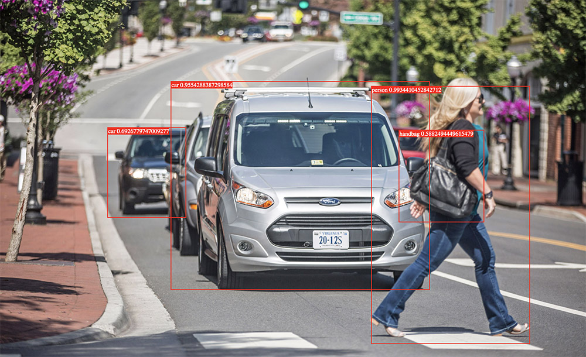

# tfjs-yolov3

### Introduction

A Tensorflow.js implementation of YOLOv3 and YOLOv3-tiny

Note: Must Tensorflow.js@v0.12.4+

# Features
- can recognize images of **any size**
- Support both **yolov3** and **yolov3-tiny**

## Quick Start

### Install

```
npm install tfjs-yolov3
```

### Usage Example

```javascript
import { yolov3, yolov3Tiny } from 'tfjs-yolov3'

async function start () {
  const yolo = await yolov3Tiny() // pre-load model (35M)
  // or
  // const yolo = await yolov3() // pre-load model (245M)

  const $img = document.getElementById('img')
  const boxes = await yolo($img) 
  draw(boxes) // Some draw function
}
start()
```


## API 文档

The yolov3 and yolov3Tiny functions accept an options object and return a function

```typescript
export declare function yolov3 (
  { modelUrl, anchors }? :
  { modelUrl?: string, anchors?: number[] }
): Promise<yolo>

export declare function yolov3Tiny (
  { modelUrl, anchors }? :
  { modelUrl?: string, anchors?: number[] }
): Promise<yolo>
```

| Parameters  | Description  |
| ------------ | ------------ |
|  modelUrl | Optional, pre-train the model's url, you can download the model to the local, speed up the loading of the pre-training model  |
|  anchors  | Optional, custom anchors, format reference[config](https://github.com/zqingr/tfjs-yolov3/blob/master/src/yolo/config.js) |

After the above two functions are called, the pre-training model will be loaded, and a function will be returned. This function can be used to identify the image and return the identified box list. The parameters are as follows:

```typescript
type yolo = ($img: HTMLImageElement) => Promise<Box[]> 

interface Box {
  top: number
  left: number
  bottom: number
  right: number
  width: number
  height: number
  scores: number
  classes: string
}
```


## DEMO

[Check out the Live Demo](https://zqingr.github.io/tfjs-yolov3-demo/)  
  



